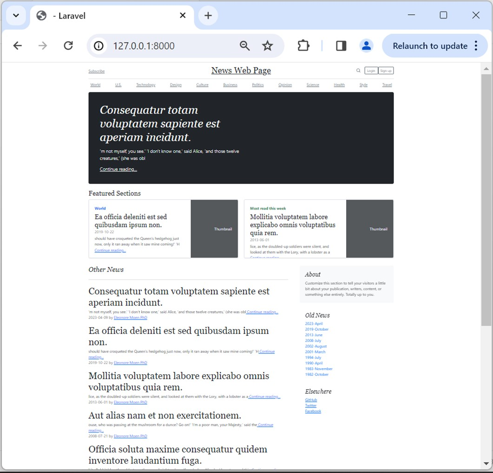
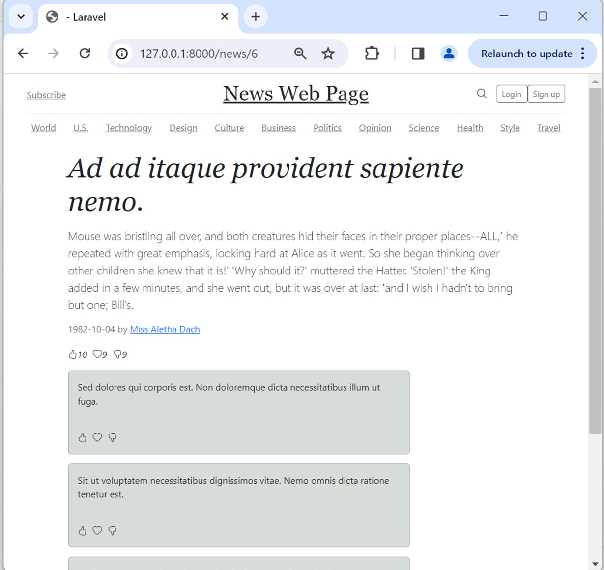

# News Webpage
This project aim to demostrate how News webpage can be developed using PHP + Laravel + Inertia + Vuejs

Display clicked news

## To run the project

Since we include Inertia to render single-file Vue components from Laravel backend, to run project first we click

### `npm run dev`

And type

### `php artisan serve`

Server will run on [http://127.0.0.1:8000]
